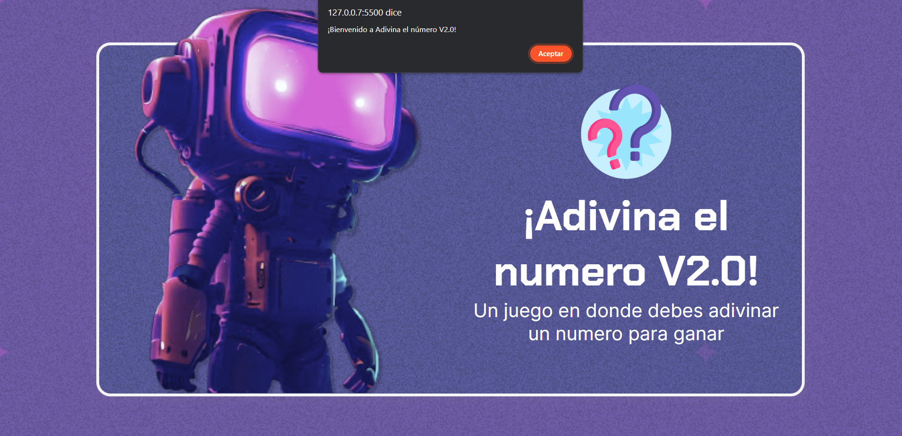

# Minijuego para adivinar un numero en JavaScript
## Ejercicio de Oracle Next Education y Alura Latam

Minijuego básico para adivinar un numero en JavaScript, como parte del curso de 
"Lógica de programación: sumérgete en la programación con JavaScript" que ofrece Alura Latam.

# Vistas de ejemplo

